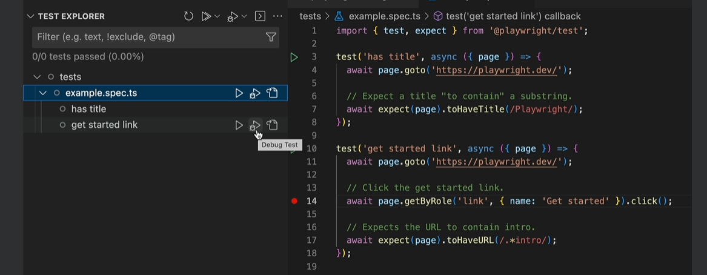

# About STARTERKIT-PLAYWRIGHT-TS

ERNI Academy starterkit to launch a Playwright framework with TypeScript.

<!-- ALL-CONTRIBUTORS-BADGE:START - Do not remove or modify this section -->
Antonio Li Causi [@tonyligit](https://www.github.com/tonyligit)
<!-- ALL-CONTRIBUTORS-BADGE:END -->

## Built With

- [Playwright](https://example.com)
- [Typescript](https://example.com)
- [Cucumber](https://example.com)


# INTRODUCTION
Based on the latest download trends, which can easily be found on various sites, we can see that Playwright is gaining more and more popularity.

It is therefore evident that ERNI should also go in this direction, and having a ready-made framework filled with best practices will help in being prepared for projects that use this feature.

# Project Structure

This project is organized to support both **Cucumber** tests and **POM** (Page Object Model) tests for various testing needs, such as API and Web testing. Users can choose to run either Cucumber feature tests or POM tests, as each is organized into distinct folders. Here’s a breakdown of the project structure and instructions to run tests.

## Folder Structure

- **`/src/test/features`**: Contains Cucumber feature files. This folder is specifically structured for behavior-driven development (BDD) tests using the Cucumber framework.
- **`/tests/API`**: Holds API tests structured with the Page Object Model (POM). These tests follow best practices for API testing using Playwright.
- **`/tests/WEB`**: Contains Web tests organized using the POM design, intended for testing the UI and functionality of web applications.

## Running Tests

You have the flexibility to run Cucumber feature tests or POM tests separately, depending on your testing requirements.

### Commands to Execute Tests

- **Run POM Tests**:
  - To execute all POM tests, use:
    ```bash
    npm run test:pom
    ```

- **Run Cucumber Tests**:
  - To execute all Cucumber feature tests, use:
    ```bash
    npm run test:cucumber
    ```

### Running Tests in Jenkins

When executing tests in Jenkins, you can specify the browser to use. The following commands are available and include both pretest and posttest scripts:

- **Chromium**:
  ```bash
  npm run test:chromium-jenkins
  ```

- **Firefox**:
  ```bash
  npm run test:firefox-jenkins
  ```
  
- **Chrome**:
  ```bash
  npm run test:chrome-jenkins
  ```

This structure provides effective organization and separation of tests, whether using Cucumber for BDD or the POM pattern for API and Web tests.


## What is Playwright
Playwright is an open-source automation library that enables reliable end-to-end testing for browser testing and web scraping developed by Microsoft and launched on 31 January 2020, which has since become popular among programmers and web developers. Playwright provides the ability to automate browser tasks in Chromium, Firefox and WebKit with a single API

## Advantages
- Cross-browser: Playwright supports all modern rendering engines, including Chromium, WebKit, and Firefox.
- Cross-platform: Test on Windows, Linux, and macOS, locally or on CI, headless or headed.
- Cross-language: Use the Playwright API in TypeScript, JavaScript, Python, .NET, and Java.
- Test Mobile Web: Native mobile emulation of Google Chrome for Android and Mobile Safari. The same rendering engine works on both your Desktop and in the Cloud.
- Reliable, no flaky tests.
- Auto-wait: Playwright waits for elements to be actionable before performing actions. It also has a rich set of introspection events. This eliminates the need for artificial timeouts, which are the primary cause of flaky tests.
- Web-first assertions: Playwright assertions are built specifically for the dynamic web. Checks are automatically retried until the necessary conditions are met.
- Tracing: Configure test retry strategies, capture execution traces, videos, and screenshots to eliminate flakes.
- Network Activity Interception: Playwright allows interception of network activity, enabling developers to stub and mock network requests. This feature is useful for simulating different network conditions and testing edge cases.
- Out-of-process testing: Browsers run web content from different origins in separate processes. Playwright aligns with modern browser architecture, running tests out-of-process, making it free from the typical in-process test runner limitations.
- Multiple everything: Test scenarios spanning multiple tabs, origins, and users. Create scenarios with different contexts for different users and run them all in one test.
- Trusted events: Hover over elements, interact with dynamic controls, and produce trusted events. Playwright uses a real browser input pipeline, indistinguishable from actual user interaction.
- Test frames and pierce Shadow DOM: Playwright selectors can pierce the shadow DOM and allow seamless interaction with frames.
- Full isolation • Fast execution
- Powerful Tooling:
  - Codegen: Generate tests by recording your actions and save them in any language.
  - Playwright inspector: Inspect pages, generate selectors, step through test execution, see click points, and explore execution logs.
  - Trace Viewer: Capture all necessary information to investigate test failures. Playwright traces include test execution screencasts, live DOM snapshots, an action explorer, test source, and more.
- Playwright can also be integrated with popular CI/CD servers like TravisCI, CircleCI, Jenkins, AppVeyor, GitHub Actions, etc.
- You can also use a Docker image to get started with cloud deployment when not using any CI/CD providers.
- Playwright simplifies the process from the start with intelligent defaults.
- It’s easy to install and offers many capabilities for more advanced scenarios.

## Disadvantages
- Playwright does not have a big community compared to Selenium webdriver
- It does not work on legacy browser such as IE11
- Playwright doesn’t support Native Mobile Apps

## Playwright Architecture

Client: Where the automation code is written in various languages such as TypeScript, JavaScript, Python, etc.
Server: The server communicates between the client and web drivers using the CDP (Chrome DevTools Protocol). All requests are transmitted over a single WebSocket connection, which helps reduce test failures and flakiness.
CDP (Chrome DevTools Protocol): A protocol used to communicate between the client and the browser.

## Playwright VS Cypress

  | Criteria                         | Playwright                                                                | Cypress                                         |
  | -----------------                | ------------------------------------------------------------------        |-----------------                                | 
  | Language	                       | JavaScript, Java, Python, and .NET C#                                     | Typescript, JavaScript                          | 
  | Test Runner Frameworks Supported | Mocha, Jest, Jasmine                                                      | Mocha                                           | 
  | Operating Systems Supported      | Windows, Linux, and macOS	                                               | Windows, Linux, and macOS 10.9 and above        | 
  | Open Source	                     | Open Source and Free	                                                     | Open Source and Free                            | 
  | Architecture	                   | Headless Browser with event-driven architecture	                         | Executes test cases directly inside the browser | 
  | Browsers Supported	             | Chromium, Firefox, and WebKit	                                           | Chrome, Firefox, and Edge                       | 
  | Support	                         | Since Playwright is fairly new, the support from the community is limited compared to Selenium | Strong community support from professionals | 
  | Real Devices Support	           | Does not support real devices for Mobile Browser Tests but supports emulators | Supports real device cloud and remote servers | 
  | Reporting	                       | Yes                                                                       | No                                                | 
  | Parallel testing                 | Yes, within spec files                                                    | Yes, only by spec files level                     | 
  | Speed winner                     | Faster Execution                                                          | Faster scripting (less code)                      | 
  | Can handle multiple tabs         | Yes                                                                       | No                                                | 
  | Documentation                    | Yes                                                                       | Yes (Better documentation compared to playwright) | 

## Playwright VS Selenium

  | Criteria                         | Playwright                                                                | Selenium                                           |
  | -----------------                | ------------------------------------------------------------------        |-----------------                                   | 
  | Language	                       | JavaScript, Java, Python, and .NET C#                                     | Java, Python, C#, Ruby, Perl, PHP and JavaScript   | 
  | Test Runner Frameworks Supported | Mocha, Jest, Jasmine                                                      | JUnit, TestNG, NUnit, etc.                         | 
  | Operating Systems Supported      | Windows, Linux, and macOS	                                               | Windows, Linux, Solaris, and Mac OS                | 
  | Open Source	                     | Open Source and Free	                                                     | Open Source and Free                               | 
  | Architecture	                   | Headless Browser with event-driven architecture	                         | Layered Architecture based on JSON Wire Protocol, also support Headless Browsers | 
  | Browsers Supported	             | Chromium, Firefox, and WebKit	                                           | Chrome, Firefox, IE, Edge, Opera, Safari, and more | 
  | Support	                         | Since Playwright is fairly new, the support from the community is limited | Strong community support across the world          | 
  | Real Devices Support	           | Doesn't support real devices for Mobile Browser Tests but supports emulators | Supports real device clouds and remote servers  | 
  | Reporting	                       | Yes                                                                       | No                                                 | 
  | Autowait	                       | Yes                                                                       | No                                                 | 
  | Trace viewer                     | Comes with Trace viewer to run and debug tests                            | No in-built feature, it depends on Test Runner to debug and execute tests |
  | Prerequisites                    | NodeJS, IDE                                                               | Java, IDE, SeleniumStandalone Server, Client Language Bindings and Browser Drivers |
  | Auto-wait                        | Yes                                                                       | No                                              | 

## WHY TYPESCRIPT
- Because Playwright itself is written in TypeScript, it provides strong typing and autocomplete support, as well as early detection of potential errors, making it easier to write and maintain code. This can lead to more robust and reliable tests.
- Enhanced Tooling: TypeScript is well-supported by popular IDEs such as Visual Studio.
- TypeScript type annotations make code more self-documenting, helping developers understand and maintain tests more easily. It also helps catch type-related errors and provides better code organization and scalability in larger projects.
- TypeScript is a statically typed superset of JavaScript, meaning that all existing JavaScript code is valid in TypeScript.

# INSTALLATION

## Software Requirements
- NodeJS
- IDE (Visual Studio Code)
- GIT
- Operating System -Window/MAC/Linux

## Steps
1. Install Node.js and Visual Studio Code:
   1. Download and install Node.js from its official website.
   2. To verify the installation, run the following command in your terminal: node -v
   3. Download and install Visual Studio Code from its official website.
2. Configure Visual Studio Code:
   1. Open Visual Studio Code.
   2. From the File menu, select the "Auto Save" option.
3. Install the Playwright extension in Visual Studio Code:
   1. Press CTRL + Shift + X, then search for and install "Playwright Test for VSCode".
   2. Open your project folder.
4. Install the Playwright
   - Install the PlaywrightIf you are generating a new project:
      - Press CTRL + Shift + P, then type and select "Install Playwright".
      - Configure Playwright, unselect the JavaScript option, and click OK.
      - Wait for the installation to complete.
   - Install the PlaywrightIf you are installing Playwright from this existing project:
      - Run the following command: npm install --force


# HOW TO GENERATE TESTS USING PLAYWRIGHT CODEGEN
Generating tests using Playwright's Codegen feature is an efficient way to automate your testing process. Codegen allows you to record your interactions with a web application and automatically generate Playwright test scripts in your preferred programming language. To get started, simply launch the Codegen tool, navigate to the desired webpage, and perform actions as needed. Playwright will capture these actions in real-time, creating a fully functional test script. This approach not only speeds up test creation but also helps ensure that your tests reflect actual user behavior, making your test suite more reliable and maintainable.

## Using Command line
Run:

```bash
npx playwright codegen 
```
Optional arguments: 
- --browser firefox 
- -o ./tests/codeGen.spec.ts 
- --viewport-size=800,600
- --device="iPhone 11 Pro"
- --help

## Using VS Code
- Open Testing From left side menu     
     
- Scroll the playwright menu until Tools -> playwright codegen will be initialiated and a browser will be open

## Example
Let's generate togheter a test to check if after an incorrect login in github, the page shows an error message
- On the browser that was just opened by the playwright codegen, paste: https://github.com/
- Click on Sign In
- Click on Username and fill with "fake user"
- Click on Password and fill it with "wrong password"
- Click on Sign in
- On the upper tab select: Asser text
- Click on the error message shown by the page: Incorrect username or password.

Generated code:

```typescript
import { test, expect } from '@playwright/test';

test('test', async ({ page }) => {
  await page.goto('https://github.com/');
  await page.getByRole('link', { name: 'Sign in' }).click();
  await page.getByLabel('Username or email address').click();
  await page.getByLabel('Username or email address').fill('fake user');
  await page.getByLabel('Password').click();
  await page.getByLabel('Password').fill('wrongpassword');
  await page.getByRole('button', { name: 'Sign in', exact: true }).click();
  await expect(page.getByRole('alert')).toContainText('Incorrect username or password.');
});
```

# HOW TO RUN A TEST
Playwright runs all tests inside the same test file sequentially and tests from different test files in parallel, depending on the number of workers you set.

## Test execution with CLI:

### Run all tests inside tests folder in serial mode  ( if headless = true inside playwright.config.ts, all test will be run in headless mode)
  ```bash
  npx playwright test --workers=1
  ```
### Run all tests inside tests folder in parralel mode
  ```bash
  npx playwright test --workers=4
  ```
### Run single file test
  ```bash
  npx playwright test ./tests/fileTestName.spec.ts 
  ```
### Run multiple files test
  ```bash
  npx playwright test fileTestName1.spec.ts fileTestName2.spec.ts 
  ```
  or 
  ```bash
  npx playwright test fileTestName1 fileTestName2  
  ```
### Run single a test by its name
  ```bash
  npx playwright test -g 'test name' 
  ```
### Run a test in a specific browser
  ```bash
  npx playwright test -g 'test name' --project=firefox 
  ```
### Run a test in a headed mode
  ```bash
  npx playwright test -g 'test name' --project=firefox --headed
  ```
### Run a test in a debug mode
  ```bash
  npx playwright test -g 'test name' --project=firefox --debug
  ```

## Using VS playwright extension and UI mode:
You have several options to run your tests:
  
### Option 1: TEST EXPLORER
You can take advantage of the test exprore to run yours tests    
       
Where you have also the option to show browser and to select a profile

### Option 2: Clicking on .ts file
You can also run your tests clicking on the arrow directly in the .ts file     

       

### Option 3: Using the Playwright test console
Execute the command:  
   ```bash
npx playwright test --ui     
  ``` 


# PLAYWRIGHT CONFIGURATION FILE
Playwright offers many options to configure how your tests are run. You can specify these options in the configuration file (playwright.config.ts). Some of the available options are:

```typescript
import { defineConfig, devices } from '@playwright/test';

export default defineConfig({
  // Playwright enforces a timeout for each test, 30 seconds by default
  timeout: 30000, 

  // Playwright enforces a timeout for the expect action, 5 seconds by default
  expect: { timeout: 5000 },

  // Look for test files in the "tests" directory, relative to this configuration file.
  testDir: 'tests',

  // Run all tests in parallel.
  fullyParallel: true,

  // Fail the build on CI if you accidentally left test.only in the source code.
  forbidOnly: !!process.env.CI,

  // Retry on CI only.
  retries: process.env.CI ? 2 : 0,

  // Opt out of parallel tests on CI.
  workers: process.env.CI ? 1 : undefined,

  // Reporter to use
  reporter: 'html',

  use: {
    // Base URL to use in actions like `await page.goto('/')`.
    baseURL: 'http://127.0.0.1:3000',

    // Collect trace when retrying the failed test.
    trace: 'on-first-retry',
  },
  // Configure projects for major browsers.
  projects: [
    {
      name: 'chromium',
      use: { ...devices['Desktop Chrome'] },
    },
    .....
  ],
  // Run your local dev server before starting the tests.
  webServer: {
    command: 'npm run start',
    url: 'http://127.0.0.1:3000',
    reuseExistingServer: !process.env.CI,
  },
});
```

# FIRST TEST CASE
 - Naming convention for test file: testName.spec.ts
 - In each specification test you need to import module: import { test, expect } from '@playwright/test'; this module will provide most of the fixture, annotetion, etc needed to build a test
 - At this point you need to create a test function:

```typescript
  test('Test name', async ({ page }) => {
   await page.goto('https://playwright.dev/');

   // Click the get started link.
   await page.getByRole('link', { name: 'Get started' }).click();

   // Expects page to have a heading with the name of Installation.
   await expect(page.getByRole('heading', { name: 'Installation' })).toBeVisible();
  });
```
  INFOS:
   - Test structure: "test('Test name', async ({ page }) => { //terstcode});", in this case {page} is playwright in-built fixture, fixture must be contained between {}
   - if you need to use special context, such as a proxy, instead of using directly page.goto() function you can create your own page using browser fixture
     const context= await browser.newContext();
     const page = await context.newPage();

# HOW TO GENERATE HTML REPORT
The HTML test report is generated automatically whenever a test is executed. By navigating the project tree inside the explorer, you will find a folder called playwright-report containing an index.html file.
The report has the following layout:    


# TRACE VIEWER
To set the trace inside a test, you need to enable tracing in your Playwright configuration. This allows you to capture detailed information about test execution, helping you diagnose issues and optimize performance.

## Open the trace viewer using CLI
To check the Trace Viewer functionality, execute:
```bash
  npx playwright test --project=firefox --trace on
```
Once the test has finished running, you can open the report and check the Trace Viewer at the bottom of each test.

## Configure the trace viewer
You can also set the trace viewer options by using the playwright.config.ts file
These are the severeal option that can be set:     
trace:
- off
- on
- retain-on-failure
- on-first-retry
- on-all-retries

## How to set the trace inside a test
Use these lines:
```typescript
     test('test name', async ({ page, context }) => {
       await context.tracing.start({snapshots:true, screenshots:true});
       ....

       await context.tracing.stop({path:'traceTest.zip'})
      });
```
  
After test execution, using the explore you can see that a zip file has been created with all traces:     
  ./test-results/example-fail-get-started-link-firefox-retry1/trace.zip       
In order to open it execute:
```bash
    npx playwright show-trace ./test-results/example-fail-get-started-link-firefox-retry1/trace.zip     
```
or you can also open the trace viewer opening the following url in your browser:     
     trace.playwright.dev
and dropping the zip file inside the open url. this action will open the trace

# DEBUGGING A TEST
Execute:
```bash
npx playwright test --project=firefox --debug
```
You will see a debug console and a browser. If you prefer to use the UI, you can also set a breakpoint in the test where you want to stop and click on "Run Debug" in the Test Explorer.     


# LOCATORS
CSS and XPath locators are not recommended by Playwright, as the DOM can often change. Instead, it is suggested to use locators that are closer to how the user perceives the page, such as role locators, or to define an explicit testing contract using test IDs.

## Recommended locators
These are the recommended built-in locators.
- page.getByRole() to locate by explicit and implicit accessibility attributes.
- page.getByText() to locate by text content.
- page.getByLabel() to locate a form control by associated label's text.
- page.getByPlaceholder() to locate an input by placeholder.
- page.getByAltText() to locate an element, usually image, by its text alternative.
- page.getByTitle() to locate an element by its title attribute.
- page.getByTestId() to locate an element based on its data-testid attribute (other attributes can be configured).

```typescript
  // Click the get started link.
  await page.getByRole('link', { name: 'Get started' }).click();

  // Expects page to have a heading with the name of Installation.
  await expect(page.getByRole('heading', { name: 'Installation' })).toBeVisible();
```
You can even combine, filtering and find parent and child locators using playwright special funcitons, for more info visit:      
https://playwright.dev/docs/locators

## Basic locators
```typescript
  await page.goto('https://playwright.dev/');
  //By tag name
  await page.locator('tagname');
  await page.locator('tagname1 tagname2');  //tag tagname2 is child of tagname1
  //By attribute
  await page.locator('[attribute="value"]'); //css
  //By ID
  await page.locator('id="username"');
  await page.locator('#username'); //css
  await page.locator('tagname#username'); //css
  //By class value
  await page.locator('.class'); //css
  await page.locator('tagname.class'); //css
  await page.locator('[class="input-full-width size-medium shape-rectangle"]');
  //By Text
  await page.locator('text=Login');
  await page.locator('input:has-text("Login")');
  //Combining different selectors
  await page.locator('input[placeholder="Email"]');
  //By Xpath
  await page.locator('xpath=//*[@id="Email"]');
  //By Css
  await page.locator('css=button');
  //By partial text match
  page.locator(':text("Using")')
  //By full text match
  page.locator(':text-is("Using the grid")')
```

## How to find locators
Add the following method inside your test:
```typescript
  await page.pause() 
```
and execute it:
```bash
  npx playwright test ./tests/example.spec.ts  --headed --project=firefox 
```
once the browser is open, using the button locator you will be able to find all the locators inside the page       
  

# TIMEOUTS (https://playwright.dev/docs/test-timeouts)
Playwright has multiple configurable timeouts, some of them have their own default value:
 - Global timeout (Default value: None)
 - Test timeout (Default value: 30000 ms)
 - expected timeout (Default value: 5000 ms)
 - Action timeout (Default value: None)
 - Navigation timeout (Default value: None)
 - Fixture timeout (Default value: None)
 - BeforeAll/AfterAll hook timeout (Default value: 30000 ms)

 Most of these timeouts can be set using the playwright.config.ts file. 

# PLAYWRIGHT ANNOTATION
You can add your own tags and annotations at any moment, but Playwright comes with a few built-in ones:

 - test.skip() marks the test as irrelevant. Playwright does not run such a test. Use this annotation when the test is not applicable in some configuration.
 - test.fail() marks the test as failing. Playwright will run this test and ensure it does indeed fail. If the test does not fail, Playwright will complain.
 - test.fixme() marks the test as failing. Playwright will not run this test, as opposed to the fail annotation. Use fixme when running the test is slow or crashes.
 - test.slow() marks the test as slow and triples the test timeout.
 - test.only() run only focused tests in the entire project.

Annotations can be added to a single test or a group of tests.

Built-in annotations can be conditional, in which case they apply when the condition is truthy, and may depend on test fixtures. There could be multiple annotations on the same test, possibly in different configurations

```typescript
  test('skip this test', async ({ page, browserName }) => {
    test.skip(browserName === 'firefox', 'Still working on it');
  });
```

# GROUPÌNG TESTS
You can group tests to give them a logical name or to scope before/after hooks to the group.

```typescript
  import { test, expect } from '@playwright/test';

  test.describe('test section 1', () => {
    test('one', async ({ page }) => {
      // ...
    });

    test('two', async ({ page }) => {
      // ...
    });
  });

  test.describe('test section 2', () => {
    test('three', async ({ page }) => {
      // ...
    });

    test('four', async ({ page }) => {
      // ...
    });
  });
```

# HOOKS
You can also use some hooks inside a spec.ts file in order to run some condition before or after all or each test.

EXAMPLE:
```typescript
import {expect, test} from '@playwright/test'

let page;

test.beforeAll(async({browser})=>{
  console.log("test is started")
})

test.beforeEach(async({browser})=>{
  page = await browser.newPage();
  await page.goto('https://www.saucedemo.com/');
  await page.locator('#user-name').fill('standard_user');
  await page.locator('#password').fill('secret_sauce');
  await page.locator('#login-button').click();
})

test.afterEach(async()=>{
  await page.locator('#react-burger-menu-btn').click();
  await page.locator('#logout_sidebar_link').click();
  await page.close();
})

test.afterAll(async({browser})=>{
  console.log("test is finished")
})

test('Add Items and Check out test', async ({}) => {
    await page.locator('#add-to-cart-sauce-labs-backpack').click();
    await page.locator('.shopping_cart_link').click();
    await page.locator('#checkout').click();
  });
  
  test('Add Items and remove from Cart test', async ({}) => {
    await page.locator('#add-to-cart-sauce-labs-backpack').click();
    await page.locator('.shopping_cart_link').click();
    await page.locator('#remove-sauce-labs-backpack').click();
  });
  ```

# TAG TESTS
Sometimes, you may want to tag your tests as @fast or @slow and then filter by tag in the test report. Alternatively, you might want to run only the tests that have a certain tag.

To tag a test, you can either provide an additional details object when declaring a test or add the @ token to the test title. Note that tags must start with the @ symbol.

```typescript
import { test, expect } from '@playwright/test';

test('test login page', {
  tag: '@fast',
}, async ({ page }) => {
  // ...
});

test('test full report @slow', async ({ page }) => {
  // ...
});
```

You can also tag all tests in a group or provide multiple tags:

```typescript
import { test, expect } from '@playwright/test';

test.describe('group', {
  tag: '@report',
}, () => {
  test('test report header', async ({ page }) => {
    // ...
  });

  test('test full report', {
    tag: ['@slow', '@vrt'],
  }, async ({ page }) => {
    // ...
  });
});
```

You can now run tests that have a particular tag with --grep command line option.
```bash
npx playwright test --grep @fast
```
Or if you want the opposite, you can skip the tests with a certain tag:
```bash
npx playwright test --grep-invert @fast
```
To run tests containing either tag (logical OR operator):
```bash
npx playwright test --grep "@fast|@slow"
```
Or run tests containing both tags (logical AND operator) using regex lookaheads:
```bash
npx playwright test --grep "(?=.*@fast)(?=.*@slow)"
```
You can also filter tests in the configuration file via testConfig.grep and testProject.grep.

# SCREENSHOTS
Insert or set the follosing setting inside the playwright.config.ts       
screenshot:     
options:   
- off (screenshot will be only taken if the step     await page.screenshot({path: 'tests/screenshots' + 'LoginPage.png'}); is present)
- on (screenshos will be present in every report)
- only-on-failure (screenshots will be present only on failures)

# HOW TO RECORD VIDEO DURING TEST EXECUTION
Insert or set the following setting inside the playwright.config.ts      
video:      
options:       
- off (videos will be only taken if the step     await page.screenshot({path: 'tests/screenshots' + 'LoginPage.png'}); is present)
- on (videos will be present in every report)
- on-first-retry
- retain-on-failure (videoss will be present only on failures)
- retry-with-video

# REPORTS
## In-Built report
Official page: https://playwright.dev/docs/test-reporters
Type of reporters:
- List
- Line
- Dot
- HTML
- Custom report through testConfig.reporter

## Thir parties Reporter
- Allure
- Argos Visual Testing
- Currents
- GitHub Actions Reporter
- GitHub Pull Request Comment
- Mail Reporter
- Microsoft Teams Reporter
- Monocart
- ReportPortal
- Serenity/JS
- Testmo
- Testomat.io
- Tesults

## Differences between in-build reporter and Allure
Improvements of Allure against playwright in-built report:
- Customisation
- Rich visual
- History adn trends
- Integration
- Attachment & Plugin


### Allure
Execute the command: npm i -D allure-playwright  and npm i -D allure-commandline
Inside the playwright.config.ts modify the line:         
"reporter: 'html',"      
and replace it with:     
reporter: [['html'],['allure-playwright']]     
If you want to check both reports, in-built and allure report.
After executing the tests you need to run:

```bash
  npx allure generate .\allure-results\ --clean
```
and 

```bash
  npx allure open .\allure-report
```

#### Automatize allure report
Run:

```bash
  npm install rimraf mkdir
```

In case of windows users add inside package.json         
   "scripts": {
    "clean:reports": "rimraf allure-report allure-results && mkdirp allure-report allure-results",
    "generate:reports": "npx allure generate ./allure-result --clean",
    "open:reports": "npx allure open ./allure-report",
    "pretest": "npm run clean:reports",
    "posttest": "npm run generate:reports && npm run open:reports",
    "execute:script": "npx playwright test --project=firefox",
    "test": "npm run execute:script || npm run posttest"
  },                  
for MAC:
    "scripts": {
    "clean:reports": "rm -rf allure-report allure-results && mkdir -p allure-report allure-results"
    .....
  },             
Now run:
```bash
  npm run test
```

# ENVIRONMENT VARIABLES
One way to use environment variables is to install the dotenv library and using .env files

```bash
npm i dotenv -D
```

in playwright.config.ts uncomment the lines under:

/**
 * Read environment variables from file.
 * https://github.com/motdotla/dotenv
 */

you can call variables from this file using the process.env.variableName

# API
Playwright allow you to mock, intercept and interact with APIs directly.

# PAGE OBJECT MODEL
It is a design pattern used in test automation to organizer source code, improve maintainability and reusability of the code

# CUCUMBER
Install cucumber extension in visual studio.
```bash
Run npm i -D @cucumber/cucumber
```
Modify package.json and set:    

  "scripts": {
    "test": "cucumber-js test"
  }
     
Create a tsconfig.json file in the root folder with the following content:    

  {
    "compilerOptions": {
      "module": "commonjs",
      "moduleResolution": "node"
    }
  }
     
You need also to configure the correct path inside setting.json file:
Press: "CTRL + ," and search for cucumber. Once you find it, click on Edit setting.json and set:
       
      "cucumber.features": [
        "src/test/features/*.feature",
    ],
    "cucumber.glue": [
        "src/test/steps/*.ts"
    ]

## Cucumber Report
The framework is already configured to generate a report after each run, you can find it inside:
- test-results\report\cucumber-report.html
- test-results\report\cucumber-report.json

A screenshot is taken everytime a test fail, if you need to take a screenshot for each step, go to:
- src\hooks\hooks.ts
And uncomment:     

  // AfterStep(async function({pickle}){
  //     // Screenshot after each step
  //     const image = await pageFixture.page.screenshot({ path: `./test-results/screenshots/${pickle.name}.png`, type: "png" });
  //     await this.attach(image, "image/png");
  // })

### Multiple cucumber HTML report
Multiple Cucumber HTML Reporter is a reporting module for Cucumber to parse the JSON output to a beautiful report. The difference between all the other reporting modules on the market is that this module has:
- a quick overview of all tested features and scenarios
- a features overview that can hold multiple runs of the same feature / runs of the same feature on different browsers / devices
- a features overview that can be searched / filtered / sorted
- a feature(s) overview with metadata of the used browser(s) / devices

Install this module locally with the following command:

```bash
  npm install -D multiple-cucumber-html-reporter
```

After running a test you need to run this command in order to produce the report:

```bash
  npx ts-node ./src/helper/reportGenerate.ts
```

Here an example of the report:     


#### Automatize allure report
Run:

```bash
  npm install rimraf mkdir
```
In case of windows users add inside package.json      

   "scripts": {
    "clean:reports": "rimraf allure-report allure-results && mkdirp allure-report allure-results",
    "generate:reports": "npx allure generate ./allure-result --clean",
    "open:reports": "npx allure open ./allure-report",
    "pretest": "npm run clean:reports",
    "posttest": "npm run generate:reports && npm run open:reports",
    "execute:script": "npx playwright test --project=firefox",
    "test": "npm run execute:script || npm run posttest"
  },      

For MAC:      

    "scripts": {
    "clean:reports": "rm -rf allure-report allure-results && mkdir -p allure-report allure-results"
    .....
  },
Now run:

```bash
  npm run test
```

## Running tests in parallel
Open the cucumber.json and set for example:     
parallel: 2

## Rerun
If you want to deactive the rerun option, got to :
 - cucumber.json         
and modify number of retries:           
      "retry": 1

# PLAYWRIGHT INTEGRATION WITH JENKINS
- Install Jenkins
- Install the following plugins:
   - Ainsi colors
   - HTML publisher plugin

- Create a new project on Jenkins using New Item, give it a name, choose freestyle project.
- Use a Source code management a local workspace.
- Select: "This proect is parameterized" and add name browser and choices:
    - test:chromium
    - test:firefox
    - test:chrome
- Select the Color ANSI Console Output under Build environment
- Add build step: Execute windows batch command and write:

```bash
   npm run %browser% 
```

- add post-build action and select Publish HTML Report
- Set HTML Directory: allure-report
   index page: index.html
   HTML title: Allure HTML Report

- Add this configuration to jenkins in order to see the html page: Manage Jenkins->Script-console and write System.setProperty("hudson.model.DirectoryBrowserSupport.CSP","") and RUN it

# MOBILE DEVICE EMULATOR
Playwright allow you to emulate mobile devices and run tests on their browser:               
If you want to run a test on a mobile device you can create the relative project inside the playwright.config.ts file, under projects:
Example:                   
  projects: [
    {
      name: 'Mobile Chrome',
      use: { ...devices['Pixel 5'] },
    },
    ....
  ]                      
and then execute the run test command selecting this project.               
If your test share more of the steps of a browser test, and they differs only in few steps, you can isolate those steps using:
```typescript                      
  test('login test', async({page}, testInfo)) => {
    ....
    if(testInfo.project.name == 'Mobile Chrome') {
      .........
    }
    .....
  }
```

  # Accesibility
  Playwright also offers the ability to check accessibility, though with some limitations. Here is an excerpt from Playwright's official page:
  ```
  Automated accessibility tests can detect some common accessibility problems such as missing or invalid properties. But many accessibility problems can only be discovered through manual testing. We recommend using a combination of automated testing, manual accessibility assessments, and inclusive user testing.

  For manual assessments, we recommend Accessibility Insights for Web, a free and open source dev tool that walks you through assessing a website for WCAG 2.1 AA coverage.
  ```

## Contributing

Please see our [Contribution Guide](CONTRIBUTING.md) to learn how to contribute.

## License


(LICENSE) © {{Year}} [ERNI - Swiss Software Engineering](https://www.betterask.erni)

## Code of conduct

Please see our [Code of Conduct](CODE_OF_CONDUCT.md)

## Stats

Check [https://repobeats.axiom.co/](https://repobeats.axiom.co/) for the right URL

## Follow us

[](https://www.twitter.com/ERNI)
[](https://www.twitch.tv/erni_academy)
[](https://www.youtube.com/channel/UCkdDcxjml85-Ydn7Dc577WQ)
[](https://www.linkedin.com/company/erni)

## Contact

📧 [esp-services@betterask.erni](mailto:esp-services@betterask.erni)

## Contributors ✨

Thanks goes to these wonderful people ([emoji key](https://allcontributors.org/docs/en/emoji-key)):

<!-- ALL-CONTRIBUTORS-LIST:START - Do not remove or modify this section -->
Antonio Li Causi [@tonyligit](https://www.github.com/tonyligit)
<!-- ALL-CONTRIBUTORS-LIST:END -->
This project follows the [all-contributors](https://github.com/all-contributors/all-contributors) specification. Contributions of any kind welcome!
